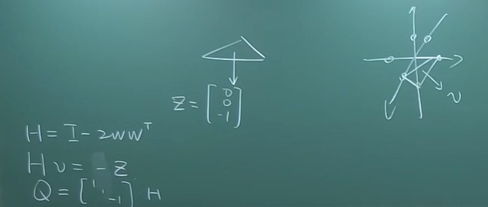
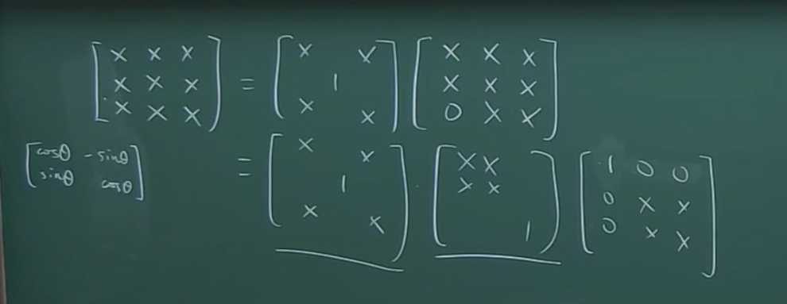
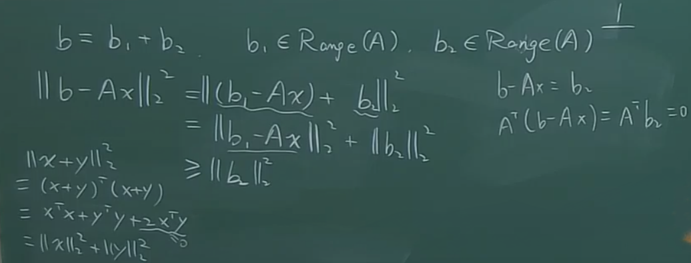
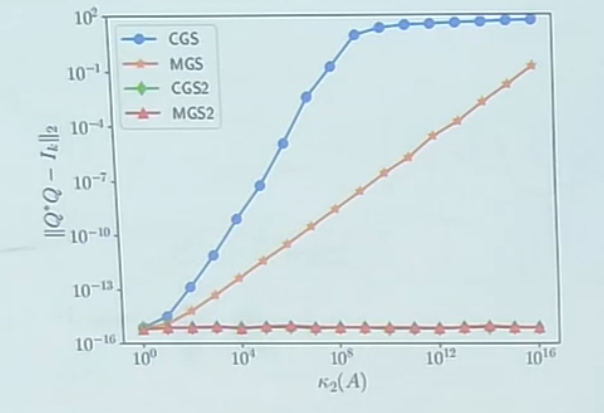

# 

镜像变换和旋转变换

两个镜像变换就是旋转变换？何意味？

啥？行列式是-1的就是镜像变换，行列式是1的就是旋转变换？

一个正交矩阵可以分解为一堆镜像变换和一堆旋转变换的乘积？

啊？好新奇。

$$
\begin{bmatrix}
    \cos \theta & -\sin \theta \\
    \sin \theta & \cos \theta 
\end{bmatrix}
$$
是旋转变换；

$$
\begin{bmatrix}
    \cos \theta & \sin \theta \\
    \sin \theta & -\cos \theta 
\end{bmatrix}
$$

则是镜像变换？

这是三个旋转变换的乘积，分别对应三个欧拉角？

欧拉旋转定理，$Qu = u \forall \det(Q) = 1$ 

# 最小二乘

矩阵求导法。

$$
Ax = b,A \in R^{m\times n} , rank(A) = n
$$

目标： $\min \lVert Ax - b \rVert ^2 _2$ 

定义 $$f(x) = (b - Ax)^T(b - Ax)$$
$$= b^Tb - 2b^TAx + x^TA^TAx$$

则 

$$\frac{\partial f}{\partial x} = 2A^TAx - 2A^Tb = 0$$

$$\frac{\partial^2 f}{\partial x^2} = 2A^TA > 0$$

为什么加上 $rank(A) = n$ 这个条件之后 $A^TA$ 就是正定的？没有就是半正定的？ 

"法方程" $A^TAx = A^T b$ 

$$
x = (A^T A)^{-1} A^T b
$$ 

🤔

为什么不这样？

条件数 $\kappa_2 (A^T A) = (\kappa_2 (A))^2$

（$\kappa_2$是啥？）

继续说法方程：

$$ A^T(Ax - b) = 0 \Leftrightarrow r \perp Range(A) $$

几何意义：

设
- $b_1 \in \mathrm{Range}(A)$：$b$ 在 $A$ 的列空间中的投影
- $b_2 \in \mathrm{Range}(A)^\perp$：与 $A$ 的列空间正交的那一部分

于是有：
$$b = b_1 + b_2$$

因为 $Ax \in \mathrm{Range}(A)$，所以 $b_1 - Ax$ 仍然在 $\mathrm{Range}(A)$ 中，而 $b_2$ 与它正交。所以可以用勾股式（正交分解）得到：

$$\|b - Ax\|_2^2 = \|(b_1 - Ax) + b_2\|_2^2 = \|b_1 - Ax\|_2^2 + \|b_2\|_2^2 \ge \|b_2\|_2^2$$

这说明：
- 残差 $\|b - Ax\|_2$ 的最小值，至少是 $\|b_2\|_2$
- 当且仅当 $Ax = b_1$ 时取得最小值（也就是让 $Ax$ 等于 $b$ 在列空间上的投影）

右侧写的是：
$$b - Ax = b_2$$

因此：
$$A^T(b - Ax) = A^T b_2 = 0$$

这就是最小二乘法的 **正规方程（normal equations）** 来源：
$$A^T(Ax - b) = 0$$

QR分解？

$$A^T(b - Ax) = 0$$

$$\Leftrightarrow Q^T(b - Ax) = 0$$

$$\Leftrightarrow Rx = Q^Tb$$

$$\Leftrightarrow x = R^{-1}(Q^Tb)$$

（咋做QR分解来着）

不是，而且它这样，为什么不直接解线性方程组啊。

满足

$$ \kappa_2(Q^TA) = \kappa_2(A) $$

QR分解的另一种算法

对 $A^TA$ 进行Choleskey分解：

$$ A^TA = R^TR,R \text{ is a lower triangular matrix}. $$

$$ Q \triangleq AR^{-1} $$

$$Q^TQ = R^{-T}A^TAR^{-1}$$

$$= R^{-T}R^TR R^{-1}$$

$$ = I$$

虽然但是不太准

啥叫构造性证明？证明了啥？证明QR分解存在？

又一种：Gram-Schmidt正交化

CGS 和 MGS 、CGS2、MGS2

对于实向量而言：

$$[a_1, a_2, \ldots, a_n] = [q_1, q_2, \ldots, q_n] \begin{bmatrix} r_{11} & r_{12} & \cdots & r_{1n} \\ & r_{22} & \cdots & r_{2n} \\ & & \ddots & \vdots \\ & & & r_{nn} \end{bmatrix}$$

$$a_1 = q_1 r_{11}$$

$$a_2 = q_1 r_{12} + q_2 r_{22}$$

$$a_3 = q_1 r_{13} + q_2 r_{23} + q_3 r_{33}$$

## Gram-Schmidt 正交化：

**1°** $r_{11} = \|a_1\|_2, \quad q_1 = a_1 / r_{11}$

**2°** $r_{12} = q_1^T a_2, \quad \tilde{q}_2 = a_2 - q_1 r_{12}, \quad r_{22} = \|\tilde{q}_2\|_2, \quad q_2 = \tilde{q}_2 / r_{22}$

**3°(CGS)**
$$\begin{cases} r_{13} = q_1^T a_3 \\ r_{23} = q_2^T a_3 \end{cases} \quad \tilde{q}_3 = a_3 - q_1 r_{13} - q_2 r_{23}, \quad r_{33} = \|\tilde{q}_3\|_2, \quad q_3 = \tilde{q}_3 / r_{33}$$

**3°(MGS)**
$$r_{13} = q_1^T a_3, \quad \hat{q}_3 = a_3 - q_1 r_{13}$$
$$r_{23} = q_2^T \hat{q}_3, \quad \tilde{q}_3 = \hat{q}_3 - q_2 r_{23}$$

对比分析：

- **CGS**: faster (level 2), less stable

$$P_i^\perp = I - Q_{i-1}Q_{i-1}^* = I - (q_1q_1^* + q_2q_2^* + \cdots + q_{i-1}q_{i-1}^*)$$

- **MGS**: slower (level 1), more stable

$$P_i^\perp = (I - q_{i-1}q_{i-1}^*) \cdots (I - q_2q_2^*)(I - q_1q_1^*)$$

（这两个式子是怎么写出来的？）

CGS2:

$$P_i^\perp = (I - Q_{i-1}Q_{i-1}^*)^2$$

MGS2:

$$P_i^\perp = ((I - q_{i-1}q_{i-1}^*) \cdots (I - q_2q_2^*)(I - q_1q_1^*))^2$$

note:

$$\text{CGS2}(A) \neq \text{CGS}(\text{CGS}(A))$$
$$\text{MGS2}(A) \neq \text{MGS}(\text{MGS}(A))$$

# Krylov 子空间

$$ \mathcal{K}(A,r,k) = \text{span}(r,Ar,A^2r,\ldots ,A^{k-1}r) $$

为什么说这组基很糟糕？

Arnoldi分解

# 广义逆

矩阵 $A$ 的广义逆（Moore-Penrose pseudoinverse）通常表示为：

$$A^\dagger $$

### 用 SVD 表示

若 $A$ 的奇异值分解为：

$$A = U \begin{bmatrix} \Sigma_* \\ 0 \end{bmatrix} V^*$$

则其广义逆为：

$$A^\dagger = V \begin{bmatrix} \Sigma_*^{-1} & 0 \end{bmatrix} U^*$$

其中 $\Sigma_*^{-1} = \mathrm{diag}(1/\sigma_1, 1/\sigma_2, \ldots, 1/\sigma_r)$，$r = \mathrm{rank}(A)$。

### 与最小二乘的关系

最小二乘问题 $\min \|b - Ax\|_2$ 的最小范数解为：

$$x^* = A^\dagger b$$

### 满足的四个 Moore-Penrose 条件

$A^+$ 由以下四个条件唯一确定：

1. $A A^+ A = A$
2. $A^+ A A^+ = A^+$
3. $(A A^+)^* = A A^+$
4. $(A^+ A)^* = A^+ A$

# SVD

设 $A \in R^{m \times n},m \geq n;$ 

$$A = U \begin{bmatrix} \Sigma_* \\ 0 \end{bmatrix} V^*$$

其中：
- $U \in \mathbb{R}^{m \times m}$ 为正交矩阵，即 $U^T U = U U^T = I$
- $V \in \mathbb{R}^{n \times n}$ 为正交矩阵，即 $V^T V = V V^T = I$
- $\Sigma_* = \mathrm{diag}(\sigma_1, \sigma_2, \ldots, \sigma_n) \in \mathbb{R}^{n \times n}$ 为对角矩阵，满足

$$\sigma_1 \ge \sigma_2 \ge \cdots \ge \sigma_n \ge 0$$

奇异值一定是非负的，并且非0奇异值的个数取决于矩阵$A$的秩：$\#\{\, i : \sigma_i \neq 0 \,\} = \text{rank}(A)$ 

$$ \kappa_2(A) = \sigma_1 / \sigma_n = \lVert A \rVert \lVert A^\dagger \rVert $$